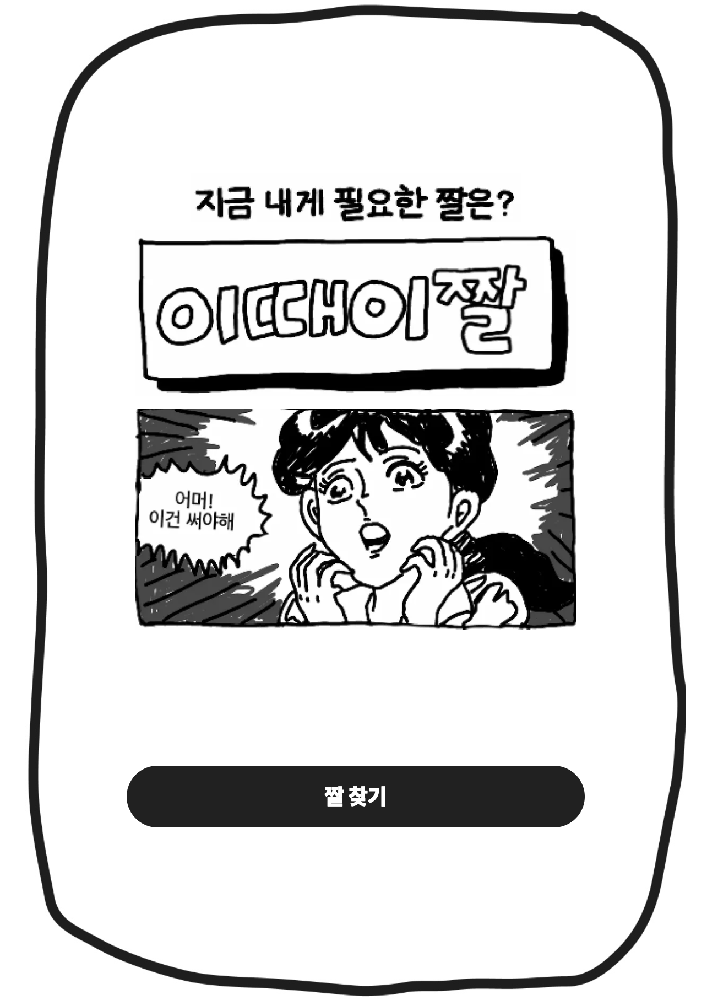
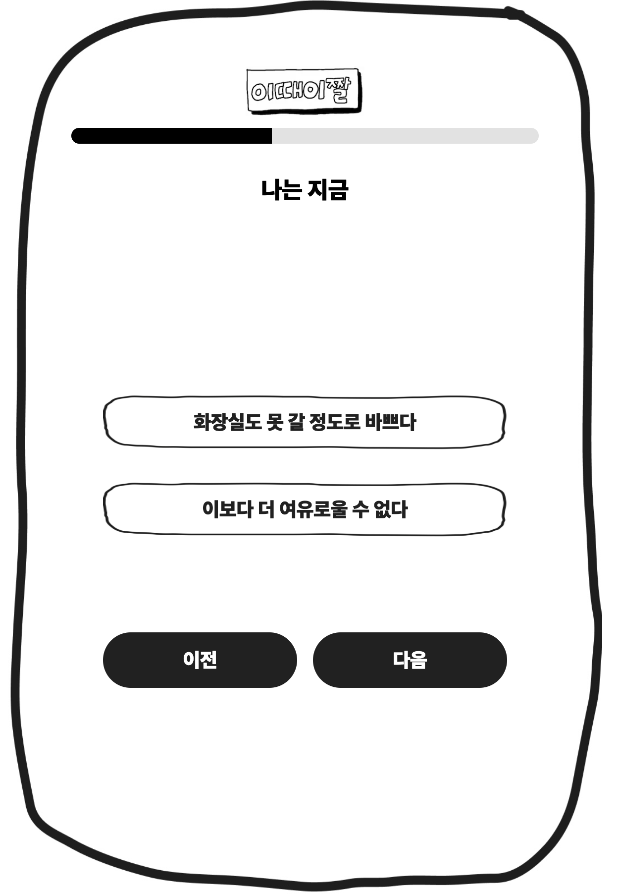
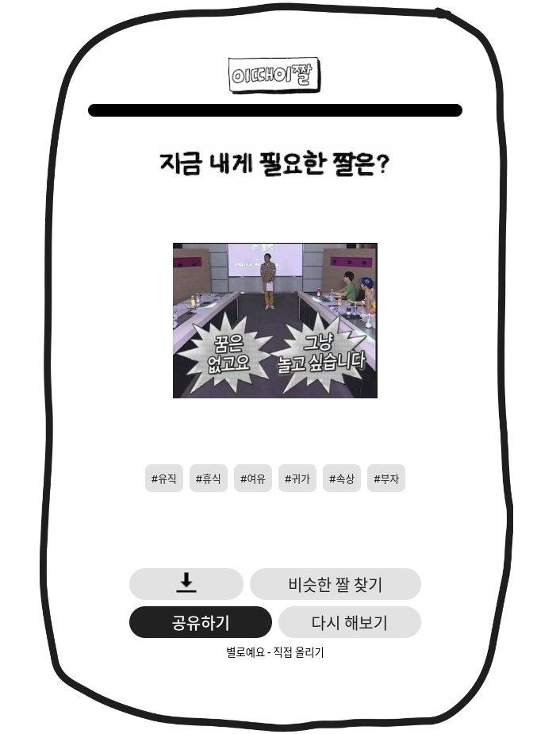

# 이때이짤

---

<image src="./.github/images/doc/main.png"/>

<a href="https://right-meme-right-now.site">⬆︎ 인생 짤 찾으러 가기 ⬆︎</a>

## 프로젝트 요약

지금 이 순간, 당신에게 필요한 바로 그 짤을 찾아드리는 "이때이짤" 입니다.

프로젝트 기간: 2023.10.18. ~ 2023.10.23.

## 프로젝트 소개

랜딩 페이지입니다. 지금 당신의 기분, 상황에 맞는 짤을 찾아보세요!

당신이 지금 어떤지 알려주세요! 꼭 맞는 짤을 찾기 위해 솔직하게 대답해봐요!

이 짤이 마음에 드셨으면 좋겠어요. 다른 분들과 공유해볼까요?

### :wrench: 기술 스택

---

 

 

## 팀 소개

<table>
    <tr height="50px">
        <td align="center">백엔드</td>
        <td align="center">프론트</td>
        <td align="center">프론트</td>
        <td align="center">프론트</td>
        <td align="center">프론트</td>
    </tr>
    <tr height="150px">
        <td align="center" width="200px">
                <a href="https://github.com/psymoney">
                    <image src="./.github/images/doc/koy.png" width="75" height="75" />
                </a>
                 
                <a href="https://github.com/psymoney">psymoney</a>
        </td>
        <td align="center" width="200px">
                <a href="https://github.com/minsoo0112">
                    <image src="./.github/images/doc/leo.png" width="75" height="75" />
                </a>
                 
                <a href="https://github.com/minsoo0112">minsoo0112</a>
        </td>
        <td align="center" width="200px">
                <a href="https://github.com/seonghun0828">
                    <image src="./.github/images/doc/jojo.png" width="75" height="75" />
                </a>
                 
                <a href="https://github.com/seonghun0828">seonghun0828</a>
        </td>
        <td align="center" width="200px">
                <a href="https://github.com/KJeeu">
                    <image src="./.github/images/doc/hodo.png" width="75" height="75" />
                </a>
                 
                <a href="https://github.com/KJeeu">KJeeu</a>
        </td>
        <td align="center" width="200px">
                <a href="https://github.com/hyunwlee-dev">
                    <image src="./.github/images/doc/dao.png" width="75" height="75" />
                </a>
                 
                <a href="https://github.com/hyunwlee-dev">hyunwlee-dev</a>
        </td>
    </tr>
</table>
